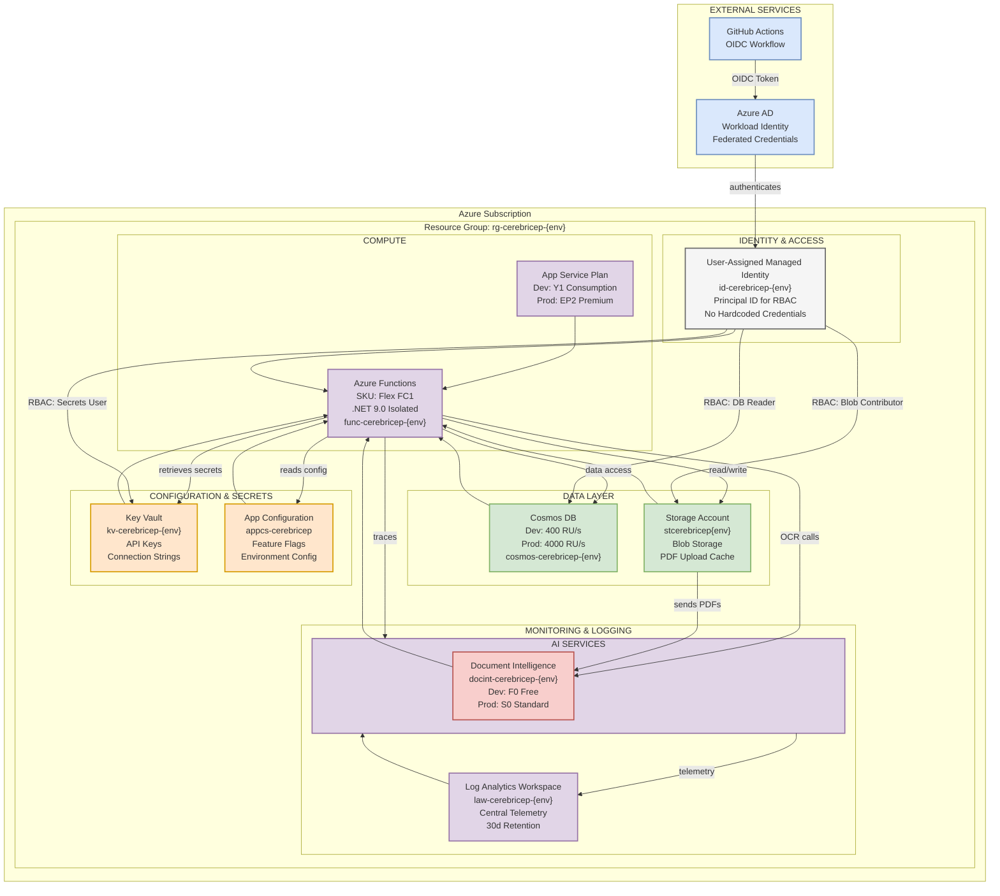

# AuthPilot Resources Architecture



## Resource Deployment Order

The resources must be deployed in this order to ensure dependencies are satisfied:

1. **Resource Group** - Container for all resources
2. **Monitoring** - Log Analytics Workspace + Application Insights (other resources depend on this)
3. **Identity** - User-Assigned Managed Identity (referenced by other services)
4. **Configuration** - Key Vault + App Configuration (provide secrets and config)
5. **Data** - Storage Account + Cosmos DB (data persistence)
6. **AI Services** - Document Intelligence (for PDF processing)
7. **Compute** - App Service Plan + Azure Functions (orchestrates everything)

## Environment-Specific Configuration

### Development (Dev)
- **Function App SKU**: Y1 Consumption
- **Cosmos DB**: 400 RU/s
- **Document Intelligence**: F0 (Free)
- **Private Endpoints**: Disabled
- **Zone Redundancy**: Disabled
- **Naming**: Unique suffix per deployment
- **Cost**: ~$15-20/month
- **Deployment**: Auto on `dev` branch push

### User Acceptance Testing (UAT)
- **Function App SKU**: EP1 Premium
- **Cosmos DB**: 1000 RU/s
- **Document Intelligence**: S0 (Standard)
- **Private Endpoints**: Enabled
- **Zone Redundancy**: Disabled
- **Naming**: Fixed suffix (-001)
- **Cost**: ~$80-100/month
- **Deployment**: Manual `workflow_dispatch`

### Production (Prod)
- **Function App SKU**: EP2 Premium
- **Cosmos DB**: 4000 RU/s
- **Document Intelligence**: S0 (Standard)
- **Private Endpoints**: Enabled
- **Zone Redundancy**: Enabled
- **Naming**: Fixed suffix (-001)
- **Cost**: ~$500+/month
- **Deployment**: Manual `workflow_dispatch` with approval

## Resource Naming Conventions

All resources follow the pattern: `{resourceType}-{workloadName}-{environment}`

| Resource | Naming Pattern | Example |
|----------|----------------|---------|
| Resource Group | `rg-{workload}-{env}` | `rg-cerebricep-dev` |
| Storage Account | `st{workload}{env}` | `stcerebricepdev` |
| Key Vault | `kv-{workload}-{env}` | `kv-cerebricep-dev` |
| App Configuration | `appcs-{workload}` | `appcs-cerebricep` |
| Cosmos DB | `cosmos-{workload}-{env}` | `cosmos-cerebricep-dev` |
| Document Intelligence | `docint-{workload}-{env}` | `docint-cerebricep-dev` |
| Function App | `func-{workload}-{env}` | `func-cerebricep-dev` |
| App Service Plan | `asp-{workload}-{env}` | `asp-cerebricep-dev` |
| Managed Identity | `id-{workload}-{env}` | `id-cerebricep-dev` |
| Log Analytics Workspace | `law-{workload}-{env}` | `law-cerebricep-dev` |
| Application Insights | `appi-{workload}-{env}` | `appi-cerebricep-dev` |

## RBAC Configuration

All resources use **User-Assigned Managed Identity** for passwordless authentication:

- **Key Vault** → Managed Identity: `Key Vault Secrets User`
- **Storage Account** → Managed Identity: `Storage Blob Data Contributor`
- **Cosmos DB** → Managed Identity: `Cosmos DB Account Reader`
- **App Configuration** → Managed Identity: `App Configuration Data Reader`
- **Application Insights** → Managed Identity: Read access for diagnostics

## CI/CD Workflow

### GitHub Actions OIDC Flow
1. GitHub Actions requests OIDC token from GitHub
2. Token exchanged for Azure AD token via Workload Identity Federation
3. Azure AD authenticates to Managed Identity using federated credentials
4. Managed Identity assumes roles for all Azure services

### Deployment Scopes
- **Subscription Level**: Resource Group creation, RBAC assignments
- **Resource Group Level**: All individual resources

### Bicep Template Flow
```
main.bicep
├── Calls module: monitoring/log-analytics.bicep
├── Calls module: identity/user-assigned-identity.bicep
├── Calls module: config/key-vault.bicep
├── Calls module: data/storage-account.bicep
├── Calls module: data/cosmos-db.bicep
├── Calls module: config/app-configuration.bicep
├── Calls module: ai/document-intelligence.bicep
└── Calls module: compute/function-app.bicep (depends on all above)
```

Each module outputs resource IDs and principal IDs used by downstream modules.
